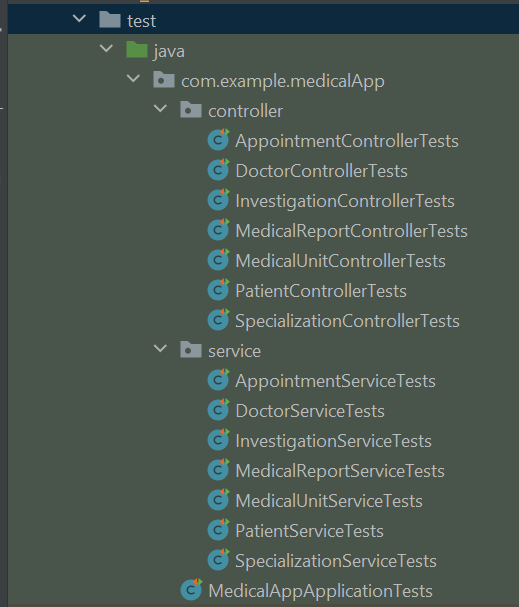

# Medical Application using Spring Boot

### Descriere

MedicalApp este o aplicatie care vine in ajutorul unitatilor si cabinetelor medicale pentru a gestiona toate activitatile din cadrul acestora,
precum medicii angajati, investigatiile pe care acestia le fac, pacienti si programarile lor, rapoartele medicale.

### Entitati
Aceasta este diagrama bazei de date, in care se pot observa 7 entitati (`Patient`, `Doctor`, `Appointment`, `Investigation`, `MedicalReport`, `MedicalUnit` si `Specialization`)
si relatiile dintre acestea:
- intr-un cabinet lucraza mai multi medici, dar un medical nu poate lucra decat intr-un singur cabinet -> `OneToMany`
- un medica poate realiza mai multe investigatii, dar o investigatie nu poate fi facuta decat de un medic
  (chiar daca procedeul ar fi acelasi, id-ul este diferit deoarece pretul poate sa difere in functie de medic) -> `OneToMany`
- un medic poate avea mai multe specializari, iar o anumita specializare o pot avea mai multi medici -> `ManyToMany`
- un pacient poate avea mai multe programari, o programare apartine unui singur pacient -> `OneToMany`
- pentru o investigatie pot exista mai multe programari, dar o programare nu poate fi facuta decat pentru o singura investigatie -> `OneToMany`
- la finalul unei programari, se poate atasa un raport medical, iar un raport medical apartine unei singure programari - `OneToOne`

//TODO INSERT DIAGRAMA     
  
### Functionalitati si endpoint-urile corespunzatoare
1. Pentru specializari:
    - se poate adauga o specializare noua   
      `POST http://localhost:8080/specialization/new; info in RequestBody`
    - se poate actualiza descrierea unei specializari   
      `PUT http://localhost:8080/specialization/{id}; descriere in RequestBody`
    - se pot vizualiza detaliile unei specializari    
      `GET http://localhost:8080/specialization/{id}`
    - se pot vizualiza toate specializarile:    
      `GET http://localhost:8080/specialization/all`
    

2. Pentru cabinete/unitati medicale:
    - se poate adauga o noua unitate medicala   
      `POST http://localhost:8080/unit/new; info in RequestBody`
    - se pot vizualiza toate unitatile medicale dintr-un anumit oras dorit    
      `GET http://localhost:8080/unit?cityName={name}`
    

3. Pentru investigatii medicale:
    - se poate adauga o noua investigatie pentru un anumit medic (doar daca medicul exista)   
      `POST http://localhost:8080/investigation/new?doctorId={id}; info in RequestBody`
    - se pot vizualiza detaliile unei investigatii   
      `GET http://localhost:8080/investigation/{id}`
    - se poate actualiza pretul unei investigatii *doar daca* noul pret este mai mic sau mai mare decat pretul actual cu maxim 10%, 
      iar pretul nu poate sa aiba, bineinteles, o valoare negativa   
      `PUT http://localhost:8080/investigation/1?price={newPrice}`
    - se pot filtra investigatiile medicale astfel inca sa fie vizualizate doar cele care au pretul mai mic decat cel dat ca parametru   
      `GET http://localhost:8080/investigation/filter?maxPrice={price}`
    - se pot vizualiza investigatiile medicale realizate de un anumit doctor dat ca parametru   
      `GET http://localhost:8080/investigation/doctor?doctorId={id}`
    - se poate sterge o investigatie *doar daca* nu exista vreo programare viitoare pentru aceasta investigatie   
      `DELETE http://localhost:8080/investigation/{id}`
   

4. Pentru pacienti:
    - se pot adauga datele unui nou pacient in sistem   
      `POST http://localhost:8080/patient/new; info in RequestBody`
    - se pot adauga informatii suplimentare la istoricul medical al unui pacient deja existent    
      `PUT http://localhost:8080/patient/1/medicalhistory; info in RequestBody`
    - se pot vizualiza datele unui pacient    
   `GET http://localhost:8080/patient/{id}`
    

5. Pentru doctori:
    - se poate adauga un doctor care sa aiba o anumita specializare (trebuie sa existe deja in sistem)
      si pentru un anumit cabinet medical (care sa existe)    
      `POST http://localhost:8080/doctor/new?medicalUnitId={id}&specializationId={id}`
    - se pot vizualiza datele unui doctor   
      `GET http://localhost:8080/doctor/{id}`
    - se poate vizualiza o lista cu toti doctorii care au o anumita specializare   
      `GET http://localhost:8080/doctor/specialization?specializationId={id}`
    - se poate vizualiza o lista cu toti doctorii angajati la un anumit cabinet   
      `GET http://localhost:8080/doctor/unit?medicalUnitId={id}`
    - se poate adauga o noua specializare pentru un doctor   
      `PUT http://localhost:8080/doctor/{doctorId}/add/specialization/{specializationId}`

6. Pentru programari:
    - se pot vizualiza o programare   
      `GET http://localhost:8080/appointment/{id}`
    - se pot vizualiza programarile care s-au incheiat ale unui anumit pacient    
      `GET http://localhost:8080/appointment/old?patientId={id}`
    - se pot vizualiza programarile viitoare ale unui anumit pacient   
      `GET http://localhost:8080/appointment/future?patientId={id}`
    - se poate adauga o programare pentru o investigatie pentru un anumit pacient 
      *doar daca* doctorul care face investigatia nu are alta programare in perioada respectiva   
      `POST http://localhost:8080/appointment/new?patientId={id}&investigationId={id}; info in RequestBody`
    - se poate sterge o programare *doar daca* aceasta nu a avut loc inca    
      `DELETE http://localhost:8080/appointment/{appointmentId}`

7. Pentru rapoarte medicale:
    - se poate vizualiza un raport medical    
      `GET http://localhost:8080/report/{id}`
    - se pot actualiza informatiile dintr-un raport medical (diagnostic, investigatii ulterioare necesare, interpretarea rezultatelor)    
      `PUT http://localhost:8080/report/{id}; info in RequestBody`
    - se poate adauga un raport medical pentru o programare   
    `POST http://localhost:8080/report/new?appointmentId={id}; info in RequestBody`

----

### Packages
Toate clasele sunt grupate în mai multe pachete:
- model: conține clasele pentru cele 7 entități, prezentate in diagrama de mai sus
- service: bean pentru definirea serviciilor (implementarea logicii de functionare a aplicatiei), câte unul per entitate
- repository: bean/interfata pentru comunicarea cu baza de date, câte unul pentru fiecare entitate
- exceptions: contine toate exceptiile custom definite, care sunt folosite in clasele Service; 
  gestionarea acestora se face printr-un ControllerAdvice    
  

----

### Validari
- Există validări la nivel de model pentru câmpurile unei entități:
   
  

- Pentru a prinde cât mai devreme orice excepție, in controller se face validarea pentru entitati, precum și pentru orice alți parametri trimisi de client:

- De asemenea, exista excepțiile custom definite pentru diferite situații, care sunt gestionate într-un ControllerAdvice:

----

### Teste unitate

#### Pentru Services: 
   

#### Pentru Controllers:

----

### Documentatie Swagger

După rularea aplicației, aceasta poate fi testata în browser la acest link: `http://localhost:8080/swagger-ui/index.html#/`.

